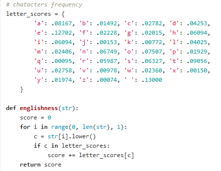
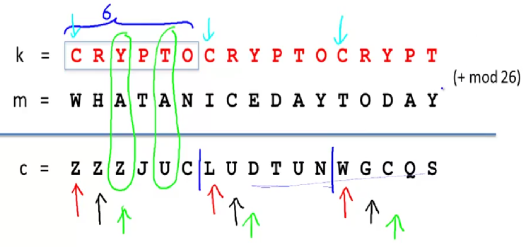

# Crypto Algorithms & How to break #
#
## Single-byte XOR cipher (Substitution cipher) ##
- **Description:** `ciphertext = key XOR plaintext`. `key` contains a *single-byte* and its duplication until the `key` has the same length as `plaintext`. e.g: 

- **How to break:** What do we have? `ciphertext`. How to get `plaintext`? `plaintext = ciphertext XOR key` => So we need `key` => Bruteforce *single-byte* `key` (maybe from `0-9`,`A-Z`,`a-z`). With every `key`, after doing `XOR` operation to get `plaintext`, calculate how "english" the `plaintext` is, based on `letters-frequency` table. The `key` with highest score would be the true key!

 

## Repeating-key XOR cipher (Vigener's cipher) ##
- **Description:** `ciphertext = key XOR plaintext`. `key` contains *multiple-bytes* and its duplication until the `key` has the same length as `plaintext`. e.g: 

 

- **How to break:**
	- **Step 1:** Get `keysize`
		- Break `ciphertext` into chunks with length `keysize` (brute-force). For each `keysize`, calculate `Hamming distance` between every 2 chunks of `ciphertext` -> Derive average `Hamming distance` of the whole `ciphertext` for that `keysize`
		- The `keysize` with lowest average `Hamming distance` is the correct one
	- **Step 2:** Get `key`
		- Break `ciphertext` into chunks with length of correct `keysize`. Create a block of every *first-byte* of every chunk (that block would be encrypted with `single-byte key XOR`) -> Decrypt that block using above `breaking single-byte xor cipher` to get the key letter
		- Do the same with next blocks of *second-byte*, *third-byte*,...,*keysize-byte* to get the FULL key!
	- **Step 3:** Get `plaintext`
		- Duplicate `key` to get key string with length of `ciphertext`
		- `plaintext = ciphertext XOR key_string`
		- Enjoy! :)