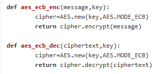
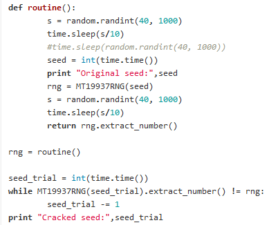
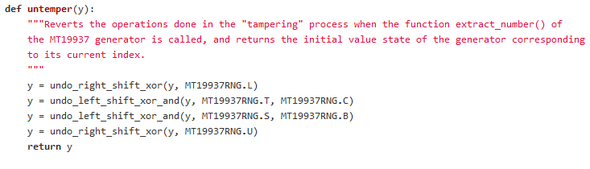
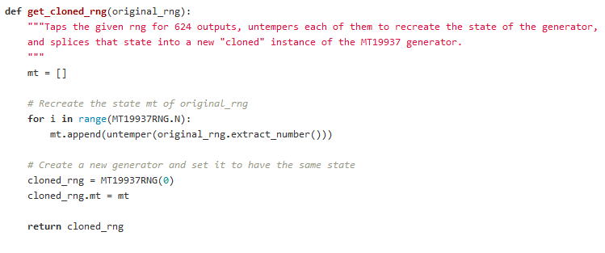
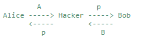
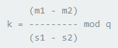
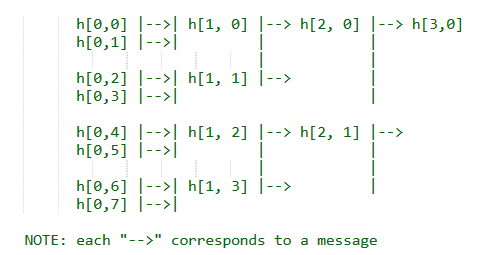
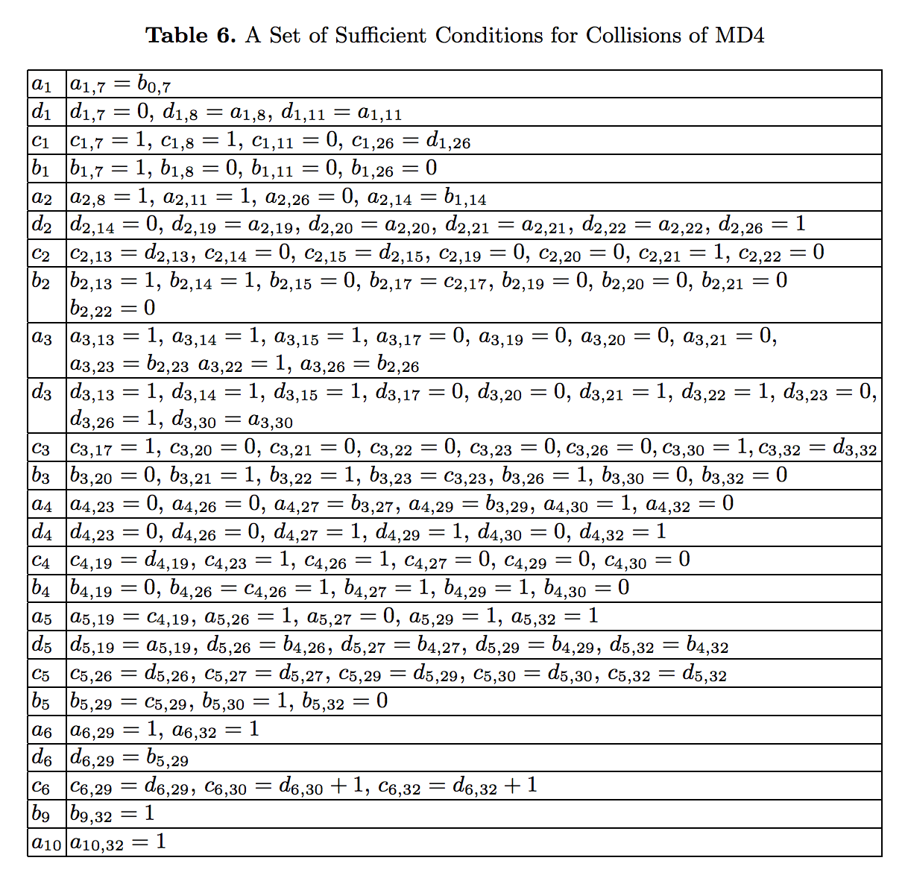

# CRYPTOPALS WRITE-UP #
#
## SET 1
###1.1. Convert hex to base64 ###
- Step 1: Convert *hex* to *ascii* using `decode('hex')`
- Step 2: Convert *ascii* to  *base64* using `b64decode`
###1.2. Fixed XOR###
- 2 methods:
	+ 1st method: Loop through each bit and assign 1 if corresponding bit is different, 0 otherwise
	+ 2nd method: Loop through each bit, and use `^` operator (xor)
###1.3. Single-byte XOR cipher (Substitution cipher) ###
- **Description:** `ciphertext = key XOR plaintext`. `key` contains a *single-byte* and its duplication until the `key` has the same length as `plaintext`. e.g: 

- **How to break:** What do we have? `ciphertext`. How to get `plaintext`? `plaintext = ciphertext XOR key` => So we need `key` => Bruteforce *single-byte* `key` (maybe from `0-9`,`A-Z`,`a-z`). With every `key`, after doing `XOR` operation to get `plaintext`, calculate how "english" the `plaintext` is, based on `letters-frequency` table. The `key` with highest score would be the true key!

 
###1.4. Detect single-character XOR###
- This challenge asks us to find which of the 60-character strings in the file has been encrypted by single-character XOR.
- Use `break_single_byte_xor` in challenge 3, iterate through all the strings, to find the possible single-character xor key and word score of each line
- Result: `Now that the party is jumping\n`
###1.5. Implement repeating-key XOR###
- Step 1: Duplicate key "ICE" to the same length as message
- Step 2: XOR them to get ciphertext!
###1.6. Repeating-key XOR cipher (Vigener's cipher) ###
- **Description:** `ciphertext = key XOR plaintext`. `key` contains *multiple-bytes* and its duplication until the `key` has the same length as `plaintext`. e.g: 

 

- **How to break:**
	- **Step 1:** Get `keysize`
		- Break `ciphertext` into chunks with length `keysize` (brute-force). For each `keysize`, calculate `Hamming distance` between every 2 chunks of `ciphertext` -> Derive average `Hamming distance` of the whole `ciphertext` for that `keysize`
		- The `keysize` with lowest average `Hamming distance` is the correct one
	- **Step 2:** Get `key`
		- Break `ciphertext` into chunks with length of correct `keysize`. Create a block of every *first-byte* of every chunk (that block would be encrypted with `single-byte key XOR`) -> Decrypt that block using above `breaking single-byte xor cipher` to get the key letter
		- Do the same with next blocks of *second-byte*, *third-byte*,...,*keysize-byte* to get the FULL key!
	- **Step 3:** Get `plaintext`
		- Duplicate `key` to get key string with length of `ciphertext`
		- `plaintext = ciphertext XOR key_string`
		- Enjoy! :)
###1.7. AES in ECB mode###
- Use `Crypto` module in python to implement ECB mode: `from Crypto.Cipher import AES`

###1.8. Detect AES in ECB mode###
- **ECB**'s problem: *the same block of plaintext will encrypt to the same ciphertext*
- So loop through each line of ciphertext, check which one has duplicated block of ciphertext, it will be the one encrypted using ECB mode

## SET 2##
###2.9. Implement PKCS#7 padding###
- E.g: For a block of 8 bytes

- For a block size of X bytes, the missing bytes will be padded with the total number of missing bytes
###2.10. Implement CBC mode###
- In CBC mode, each block of plaintext is XORed with the previous ciphertext block before being encrypted. We need an IV for the first block of plaintext.

- The `encrypt()` function will split the plaintext into blocks (usually size 16), and then do the encryption
- The `decrypt()` function will split each block of ciphertext, decrypts it, and XORs with the previous block of ciphertext to recover the plaintext
###2.11. An ECB/CBC detection oracle###
- This challenge asks us to detect whether we’ve encrypted a text with ECB or CBC, chosen at random.
- Recall the properties of ECB vs CBC — ECB will take two identical plaintext blocks and produce two identical ciphertext blocks.
- So just detect ECB using the function in challenge 8. If it's ECB, return ECB. If not, return CBC
###2.12. Byte-at-a-time ECB decryption (Simple)###
- **WHAT WE HAVE?** an oracle that produces `AES-128-ECB(your-string || unknown-string, random-key)`
- **GOAL:** find unknown-string with this oracle. 
- **STEPS:**
	+ Step 1: find the block size of the cipher
		+ feed in incrementing offsets to the oracle, until the ciphertext length increases.
		+ The size of the increase will be block_size, because of the padding.
	+ Step 2: find the flag byte-by-byte
		+ How? Since I control my-string, I can ensure each time that the oracle encrypts 15 bytes that I know + one unknown byte. I can then create a table of all possible ciphertexts of the 15 known bytes + 1 unknown byte, and compare the ciphertext the oracle returns to the ciphertexts in my table.
###2.13. ECB cut-and-paste###
- **WHAT WE HAVE?** "login" page (profile_for(email) function) with input for email + ciphertext (or cookie) for user profile AFTER inputting email + decrypting function (with unknown key - set key as global) to see user profile
- **GOAL**: Change our email so that the ciphertext from "email=XX..XX&uid=10&role=user" => "email=XX..XX&uid=10&role=admin" (XX..XX is our email input)
- **WHAT WE KNOW?**
	 This challenge uses AES128 => each block has 16 bytes
	 2 things in ciphertext NEED to be changed - "XX..XX" and "user"->"admin" => So we need at least 2 blocks (16 bytes each block - but in practice, we don't know which cipher it uses, we need a function to find the block size) to hold each one. Why need separate blocks to hold for each text we want to change? 1 byte is changed -> whole block is changed
- **WHAT TO DO?**
	+ GOAL: Find EVIL ciphertext of "email=XX..XX&uid=10&role=admin" 
	+ 3 main steps to do:
		+ STEP 1: Get ciphertext1 of 1st block "email=XX..XX&uid=10&role="
			+ STEP 1.1: Determine how many "X" to input based on the block size
			+ STEP 1.2: Input email = "XX..XX" ("XX..XX" can be any character - "AA..AA")
			+ STEP 1.3: Get ciphertext of profile_for(email) (only get padded block of "email=XX..XX&uid=10&role=")
		+ STEP 2: Get ciphertext2 of 2nd block "adminPPPPPPPPPPP" (P - padding byte)
			+ STEP 2.1: Determine how many "X" to input to push "admin" to 2nd block
			+ STEP 2.2: Input email = "XX..XX" || "admin" || padding PKCS7
			+ STEP 2.3: Get ciphertext of profile_for(email) (only get 2nd block of 16 bytes)
		+ STEP 3: EVIL ciphertext = ciphertext1 || ciphertext2
	+ Thanks to ECB's vulnerability (same plaintext '+' same key = same ciphertext), if we have ciphertext of "email=XX..XX&uid=10&role=admin", we ALWAYS have plaintext as "email=XX..XX&uid=10&role=admin" under the same key in session
###2.14. Byte-at-a-time ECB decryption (Harder)###
- **GOAL:** Decrypt unknown string byte-by-byte
- **WHAT WE HAVE?**
	 `Ciphertext  AES_128_ECB(random_prefix || user's input || unknown_string)`
- **WHAT WE KNOW?**
	 We can decrypt unknown_string byte-by-byte by repeatedly calling AES_128_ECB with specific input
- **WHAT TO DO?**
	 Same as challenge 12 + determine "random_prefix" size so that we can pad the input with missing bytes of "random_prefix" to get block-aligned.
	+ **How to determine "random_prefix" size?**
		+ 1.Create a buffer of block size length
		+ 2.Concatenate your buffer with itself N times (where N is a large positive integer) and use this as your input to the encryption oracle. For example, if N = 2 and your buffer is "YELLOW SUBMARINE", your input would be "YELLOW SUBMARINEYELLOW SUBMARINE".
		+ 3.Pass your input to the encryption oracle to obtain a ciphertext. Search the ciphertext for N consecutive identical blocks. The index of the first byte of the N blocks is the beginning of your input and also the length of the random_prefix!
		+ 4.If you can't find N consecutive identical blocks in the ciphertext, it's probably because the random_prefix is not block aligned. Prepend 1 byte to your input and go back to step 3.
		+ 5.Note: To get the true size of the random_prefix, you must subtract the number of prepended padding bytes
		+ 6.If you have prepended block_size - 1 bytes to the input and you still cannot find N consecutive identical blocks, the ciphertext wasn't encrypted in ECB mode and we're out of luck.

###2.15. PKCS7 padding validation###

###2.16. CBC bitflipping attacks###
- **WHAT WE HAVE?**
	 + `ciphertext = generate( 
			AES_128_CBC_ENC("comment1=cooking%20MCs;userdata=" || payload || ";comment2=%20like%20a%20pound%20of%20bacon")
		)`
	 + `output = AES_128_CBC_DEC(ciphertext)`
	 + Only input in payload
	 ";","=" will be removed from input by generate() function

- **GOAL:**
	 Output contains ";admin=true;"

- **WHAT TO DO?**
	 + Modify ciphertext -> Break CBC mode cipher
	 + How to modify ciphertext? ()
		 + Theory: In CBC mode, since we XOR each decrypted block with previous ciphertext block, we can change a byte in plaintext by changing CORRESPONDING byte in previous ciphertext (though this completely corrupts previous plaintext - but we can create a JUNK block to be corrupted) => use this to produce the unescaped characters ";" and "=" in the plaintext!
		 + Practice:
			 + junk_block = "A" * 16
			 + admin_block = "AadminAtrueA"
			 + => Change 3 "A" bytes in admin_block with ";","=",";" respectively. How? change ciphertext of each corresponding "A" byte in junk_block, so that after XOR function, we get ";","=",";". Change with what? Here's intersting part.
			 (1) x XOR y = 'A'  || x: ciphertext byte in junk_block, y: decrypted byte
			 (2) z XOR y = ';'  || z: ciphertext byte we need to find
			 (1) XOR (2) => z = x XOR ('A' XOR ';')
			 replace x with z
			 ... same steps with "="
			 ...
			 after changing 3 bytes in ciphertext, we get the EVIL ciphertext = "....z1...z2...z3...."!
			 decrypt it and enjoy!

## SET 3 ##
###3.17. The CBC padding oracle###
- **WHAT WE HAVE?**
	+ A ciphertext
    + A paddding oracle (a service that receives ciphertext -> decrypts it -> check valid PKCS7 padding -> return True | False)

- **GOAL?**
     Decrypt ciphertext by calling padding oracle repeatedly (brute-force)

- **How?**
     + Suppose we have 2 ciphertext blocks: C = C1 || C2, and plaintext of C2 is P2
     + Let the last byte in ciphertext block 1 be C1_15, last one in decrypted block 2 be D1_15, last one in plaintext block 2 be P2_15
     + Goal: guess P2_15 correctly
     + How?
         + Change C1_15 = C1_15 XOR guess XOR '0x01' -> We have new C' 
         + Brute-force guess ( 0 <= guess <= 256), for each guess, padding_oracle(C') to get 
           `P2_15' = C1_15' XOR D1_15 = C1_15 XOR guess XOR '0x01' XOR D1_15 = P2_15 XOR guess XOR '0x01'`
         + If guess == P2_15 => Save guess
     + Repeat with second to last byte, third to last byte, ... with padding byte "0x02","0x03",...
     => Decrypted block C2
     + Repeat the same process to decrypt block C3 by modifying ciphertext block C2, C4 by C3, C5 by C4, ...
     + **NOTE:** Decrypt block C1 why modifying ciphertext IV
###3.18. Implement CTR, the stream cipher mode###
- CTR encryption:

- CTR decryption:

- CTR parameters: 
	+ key= YELLOW SUBMARINE
    + nonce = 0
    + format = 64 bit unsigned little endian nonce, 64 bit little endian block count (byte count / 16)
###3.19. Break fixed-nonce CTR mode using substitutions###
- **THEORY:**
	 Because the CTR nonce wasn't randomized for each encryption, each ciphertext has been encrypted against the same keystream.

- **WHAT TO DO?** 
	 + Function 1: (multiple encryption) take a list of base64 text and encrypt each one then return list of encrypted text
	 + Function 2: (multiple decryption) take a list of ciphertexts and find the keystream 

- **HOW TO FIND?**
	 + `ciphertext XOR plaintext = keystream`
	 + `ciphertext XOR keystream = plaintext`
	 + Take the longest ciphertext, brute-force first corresponding plaintext byte then XOR with first ciphertext byte to get corresponding keystream byte X.
	 + XOR that keystream byte with the rest corresponding bytes in other ciphertexts to produce corresponding plaintext bytes.
	 + Check how "english" those plaintext bytes are -> save score.
	 + Brute-force next plaintext byte -> repeat.
	 The keystream byte X with the highest score would be the CORRECT keystream byte.
	 + Repeat same process with next bytes
	 + Finally, we get the full keystream -> XOR it with each ciphertext to get plaintext
###3.20. Break fixed-nonce CTR statistically###
- **WHAT TO DO?**
	Same as 19
- **HOW TO DECRYPT:**
	+ Concatenate all padded-to-longest-length ciphertexts into 1 string
	+ Since each ciphertext is encrypted using the same key -> the whole string is encrypted with repeated-key-xor
	+ Use break-repeating-key-xor function in challenge 6 to get the keystream
	+ XOR that keystream with each ciphertext to get plaintext
###3.21. Implement the MT19937 Mersenne Twister RNG###
- Implement psuedocode from wiki: https://en.wikipedia.org/wiki/Mersenne_Twister
###3.22. Crack an MT19937 seed###
- Just brute-force the seed (timestamp) backward in time (seed_trial -= 1) until it has the same PRNG with the original seed

###3.23. Clone an MT19937 RNG from its output###
- To clone an MT19937 RNG, we need to find its 624-value internal state by reverse-engineering MT19937
- **STEPS:**
	+ get 624 RNG outputs
	+ untemper each one (more details in my code)
	
	+ Create a new generator and set it to have the same state
	
- **QUESTION!** What if we don't have all 624 outputs? can we still predict next output with clone?
###3.24. Create the MT19937 stream cipher and break it###
- **What we have?**
	+ Task 1: 
		+ create a MT19937Cipher with a given key as seed to encrypt / decrypt a plaintext / ciphertext 
		+ with only ciphertext, find the MT19937Cipher key using a known plaintext
	+ Task 2:
		+ create a token using MT19937RNG seeded with current time
		+ write a function that checks whether a token is generated using MT19937RNG seeded with timestamp
- **What to do?**
	+ Task 1:
		+ create a MT19937Cipher class with encrypt / decrypt functions. encrypt() generates a keystream using MT19937RNG seeded with 16-bit key (repeatedly until keystream has the same length with plaintext)
		+ Brute-force key from 0 - 2^16 until the decrypted plaintext contains the known-plaintext
	+ Task 2:
		+ same as 22

## SET 4##
###4.25. Break "random access read/write" AES CTR###
- **GOAL:** Recover the original plaintext after encrypt it under CTR and edit ciphertext by `edit(ciphertext, key, offset, newtext)`. 
- **HOW?**
	+ Because we can seek into the ciphertext and edit arbitrary characters, we we can simply guess each plaintext character.
	+ For each byte in the ciphertext, I can try all 256 characters by replacing the ciphertext byte with my encrypted guess using the provided edit() function. If the new ciphertext exactly matches the original ciphertext, then I know my guess for the plaintext character is correct, since it encrypted to the same byte.
###4.26. CTR bitflipping###
- **WHAT WE HAVE?**
	+ An oracle - a service that encrypt a text = prefix || our input || postfix using AES in CTR mode, then return ciphertext
	+ That oracle will clean ";", "=" from our input
	+ That oracle also provide decrypt() to decrypt ciphertext
- **GOAL?**
	+ Make output of oracle's decrypt() produce a text include ";admin=true"
- **HOW?**
	+ Step 1: get ciphertext prefix size => append ADMIN ciphertext (C2) after that
		+ Encrypt two different ciphertexts
		+ Since the stream ciphers encrypts bit by bit, the prefix length will be equal to
		+ the number of bytes that are equal in the two ciphertext.
	+ Step 2: create ADMIN ciphertext 
		+ We can get ciphertext C1:		C1 XOR keystream = "?admin?true"	(1)
		+ We want to get ciphertext C2: C2 XOR keystream = ";admin=true"	(2)
		+ (1) XOR (2) =>	C1 XOR C2 = "?admin?true" XOR ";admin=true"		(3)
		+ C1 XOR  (3) =>	C2 = C1 XOR "?admin?true" XOR ";admin=true"
		+ EVIL ciphertext = ciphertext(prefix) + C2 + ciphertext(postfix)
		+ => Now decrypt EVIL ciphertext to get ADMIN privilege!!
###4.27. Recover the key from CBC with IV=Key###
- **WHAT WE HAVE?**
	+ An insecure oracle provides
		+ a service that encrypts prefix || messages || postfix in CBC mode with IV = key
		+  a service to decrypt ciphertext + check ADMIN privilege + check if all characters in a plaintext are ASCII compliant (in ASCII table - printable), if not, will show exception and return the corrupted text
- **GOAL?**
	+ Get the hidden key from oracle
- **HOW?**
	+ Basically, send 3 blocks ( block_size = 16 (AES) ) of ciphertext to oracle's service - check admin: 
		+ `CT = C1 || "\x00" * block_size || C1 `
		+ oracle decrypts plaintext: `PT = iv XOR dec(C1) || ........ || "\x00 * block_size" XOR dec(C1)`
		+ oracle returns corrupted PT from exception to attacker
		+ Attacker computes: `P1 XOR P3 = iv XOR "\x00 * block_size" = iv = key`
###4.28. Implement a SHA-1 keyed MAC###
- Implement from psuedocode in wikipedia: https://en.wikipedia.org/wiki/SHA-1
###4.29. Break a SHA-1 keyed MAC using length extension###
- **WHAT WE HAVE?**
    + An oracle - a service using SHA1-MAC to:
        + Generate a SHA1 MAC digest for a message using a secret key
        + Check the given digest matches the SHA1 MAC of a message
- **GOAL?**
    + Modify a message in-flight provided with its digest -> forge a new message containing extra payload (e.g: 'admin=true')
- **HOW?**
    + To break SHA1 MAC, we need to get its padding state (pre-processing state), after forged the new message, and the internal state (h0,h1,h2,h3,h4)  
    + Brute-force key-length until forged digest is the same as digest of forged message:
        + Get the forged message (original-message || glue-padding || new-message)
        + glue-padding? Pads the given message the same way the pre-processing of the SHA1 algorithm does.
        + Get the SHA1 internal state (h1, h2, h3, h4, h5) by reversing the last step of the hash
        + Get SHA1 hash of the extra payload, by setting the state of the SHA1 function to the cloned one that we deduced from the original digest.
        + If the forged digest is valid, return it together with the forged message.
        + Else, keep brute-forcing
###4.30. Break an MD4 keyed MAC using length extension###
- Same as 29 with MD4 implementation
###4.31. Implement and break HMAC-SHA1 with an artificial timing leak###
- **WHAT WE HAVE?**
	+ A server: 
		+ handles request: "http://localhost:8888/test?file=XXX&signature=XXX" || client inputs XXX
		+ Validate the digest of filename with the signature (insecurely) by checking byte-by-byte with delay time and stops at incorrect byte
	+ A client:
		+ Recover the digest byte-by-byte with timing attack
- **GOAL?**
	+ Recover the digest byte-by-byte with timing attack
- **HOW?**
	+ Iterate through all possible bytes (0 - 15 <=> 0 - F), making a request with my known bytes + byte_guess + padding.
	+ Take the maximum delay each time, which would occur when I've guessed the byte correctly, causing another sleep of 50ms, for an added delay of 100ms.
	+ The byte with maximum delay each time is the correct byte for a position in digest
	+ Append that byte to known bytes (found bytes) and brute-force next byte
- **NOTE:**
    + Run challenge\_31\_server.py before attack
    + Then run challenge\_31\_client.py
###4.32. Break HMAC-SHA1 with a slightly less artificial timing leak###
- Same as 31 but add normalization method for more accuracy
- **NOTE:** Run challenge\_31\_server.py before attack

## SET 5##
###5.33. Implement Diffie-Hellman###
- **Diffie-Helman (basic key exchange):**
- Alice & Bob wants to exchange secret key in an open channel
- => Alice sends A to Bob, Bob sends B to A
- Alice has secret a, Bob has secret b such that, A = (g ^ a) mod p, B = (g ^ b) mod p (g, p are constants)
- => Secret key of Alice & Bob is kAB = A^b = B^a = (g ^ ab) mod p
###5.34. Implement a MITM key-fixing attack on Diffie-Hellman with parameter injection###

- kAB = (p^a) mod p = (p^b) mod p = 0
- -> Secret key of Alice & Bob becomes 0!
- -> Hacker uses the key to decrypt messages
###5.35. Implement DH with negotiated groups, and break with malicious "g" parameters###
- Same as challenge_34
- **NOTE:** 
	+ When g = 1, all powers of g are 1 as well => secret key is always 1
	+ When g = p, as in challenge 34, powers are all divisible by p => secret key is always 0
	+ When g = p-1 is raised to a power, then mod p will be either 1 or -1
###5.36. Implement Secure Remote Password (SRP)###
- Secure Remote Password (SRP)
- A form of authentication in which the client does not need to reveal password
- Server: 
	+ stores a verifier for a client that wants to authenticate, `v = g ^ x, x = H(salt, password)`
	+ A salt is a random value used to safeguard the password hash from being easily identifiable in a hash lookup rainbow table
	+ Generate a session key K with verifier
- Client: 
	+ After exchaing some parameters with server, generate a session key K with password
	+ => The server checks client's K == server's K => If true, successfully authenticates the client
###5.37. Break SRP with a zero key###
- **NOTE!!!** RUN challenge\_36\_server first
- Break SRP with a zero key:
	+ Server produces K by: 
		+ `S = (A * v ^ u) ^ b mod N`
		+ `K_server = H(S)`
	+ => A = 0 or A = N or A = N^2 => S = 0 
	+ => we can authenticate simply by sending K_client = H(0) without knowing the password!
###5.38. Offline dictionary attack on simplified SRP###
- **NOTE!!!!** 
	+ Use `Python 3` for challenge\_38\_server.py and challenge\_38\_client.py
	+ Due to issues of sha256 in `python 2` (e.g: "utf-8" encoding issue: UnicodeDecodeError: 'ascii' codec can't decode byte...)
	+ `Python3` doesn't have web.py yet so I had to use "flask" for server-client protocols
- **Explain:**
	+ Same as challenges 36,37 but now Server "leaks" some parameters like b, B, u, salt
	+ From those params, MITM hacker can compute session key K and brute-force K until get common dictionary word for password
###5.39. Implement RSA###
- **RSA**
	+ Basic of RSA is about to find 3 prime numbers e, d, n (n - very large prime) such that for all m (0 < m <n)
	+		(m ^ e) ^ d = m (mod n)
	+	NOTE: even knowing e and n or even m it can be extremely difficult to find d
- **RSA algorithm** involves 4 steps:
	+ Key generation: 
			+ compute p, q, n = p*q, phi(n) = (p-1)*(q-1) such that lcm(n, phi(n)) != 1
			+ e = 3 (for this challenge)
			+ d = invMod(e, n)
	+ Key distribution
		+	Suppose that Bob wants to send information to Alice. If they decide to use RSA, 
		+ Bob must know Alice's public key (n, e) to encrypt the message and Alice must use her private key (n, d)
		+ to decrypt the message. To enable Bob to send his encrypted messages, Alice transmits her public key to Bob 
		+ via a reliable, but not necessarily secret, route. Alice's private key is never distributed.
	+ Encryption
		+ ciphertext\_int = message\_int ^ e (mod n)  
	+ Decryption
		+ message\_int = ciphertext\_int ^ d (mod n)
###5.40. Implement an E=3 RSA Broadcast attack###
- Attack RSA based on CRT (Chinese Remainder Theorem):
	+ Let p, q be coprime. Then the system of equations:
		+ x = a (mod p)
		+ x = b (mod q)
	+ have a unique solution x modulo (p * q)
- For RSA:
	+ Attacker got CT1, CT2, CT3 with corresponding public keys N1, N2, N3:
		+ C1 = M^3 mod N1
		+ C2 = M^3 mod N2
		+ C3 = M^3 mod N3
	+ => We need to find M (unique)
	+ => Follow the steps in the challenge to find M

## SET 6##
###6.41. Implement unpadded message recovery oracle###
- The Oracle (server) provides service to encrypt user's message and decrypt ciphertexts (NOT in database)
- The attacker can ask for the encryption and decryption of anything he/she wants - except user's ciphertexts which are in database
- => **GOAL:** Attacker recover user's message from its ciphertext using decryption service of server
- **HOW?** 
	+ In Unpadded RSA,  if operations like multiplication and addition are carried out on ciphertext, it is as if the same operation were applied to the plaintext
	+ => The attacker can't ask for the decryption of user's ciphertext, but attacker can ask for the decryption of ciphertext\_2 and attacker knows that the result will be plaintext\_2. 
	+ => Just divide out the scaling factor, and attacker has the plaintext.
###6.42. Bleichenbacher's e=3 RSA Attack###
- When signing a message using RSA:
 	+ User generates signature using (n, d): sig = m ^ d mod n
	+ Server verifies signature using (n, e): (sig ^ e mod n) == m
- In this challenge, instead of signing message, m, we sign the PKCS1.5 encoding of message's hash:
	+	00 01 FF FF ... FF 00 ASN.1 HASH
- How to exploit?
	+ A faulty PKCS1.5 verifier might not check all "FF" bytes in middle exist
	+ We can generate "corrupted" PKCS1.5 padding message:
	`forged_m = 00 01 FF 00 ASN.1 HASH_M GARBAGE`
	+	=> Forged signature (forged_sig) will be the cube root of that (in power of 1/e with e=3)
- Verifying process: 
	+	Oracle checks: 
		+ `(forged_sig ^ e) mod n` contains "00 01 FF 00" ? True because `= forged_m ^ ((1/e) * e) mod n = forged_m`
		+ `HASH_M == H(message)` ? 
###6.43. DSA key recovery from nonce###
- **NOTE:** USE `PYTHON3` !! `python2` doesn't give correct result, I'll look into it when I have time.
- DSA (Digital Signature Algorithm) involves 3 main parts:
	+ Key generation:
		- Generate a 1024-bit prime p
		- Find a 160-bit prime divisor q of p-1
		- Find an element g which generates the subgroup of p with q elements
		- Choose a random private key x (0 < x < q)
		- Compute y = g ^ x mod p
		- => The keys are now:
			-	public = (p, q, g, y)
			-	private = (x)
	+ Signing:
		- Choose a random key 0 < k < q
		- Compute `r = g ^ k mod q`
		- Compute `s = (SHA(message) + x*r) * inv_mod(k, q) mod q`
	+ Verifying:
		+ Compute `w = inv_mod(s, q)` 
		+ Compute `u1 = w * SHA(message) mod q`
		+ Compute `u2 = w * r mod q`
		+ Compute `v = (g^u1 * y^u2 mod p) mod q`
		+ Verify `v == r mod q`

- How to recover private key from signature's nonce?
	- Attacker has: H(message), r, s, y (public key)
	- Given k, private key can be calculated:
			`x = (s * k) - H(message) * inv_mod(r,q) mod q`
	- Attacker brute-forces k until `get_public_key_from_private_key(x) == y`
	- if True, return x - the private key
###6.44. DSA nonce recovery from repeated nonce###
- **NOTE:** USE `PYTHON3` for this challenge!! `python2 `doesn't give correct result, I'll look into it when I have time.
- When messages are signed using DSA with repeated nonce (r, k), given a pair of messages, attacker can find k using the formula:
- 

- Proof! (mathematically)
	- private key formula: 
		- `x = (s1 * k) - m1 * inv_mod(r1,q) mod q`
		- `x = (s2 * k) - H(messa * inv_mod(r2,q) mod q`
		- if r1 == r2:
		- => `k = (m1 - m2) / (s1 - s2) mod q`	
	- We have k => We have x! (same as challenge 43)
###6.45. DSA parameter tampering###
- If g = p + 1 or g = 0 => r = (g ^ k) mod p = 1 for ALL k
 => same signature can be verified for different messages
###6.46. RSA parity oracle###
- plaintext P is within the bounds [0, N] - LB(lower bound) = 0, UB(uppder bound) = N
 iterate this algorithm log2(N) times to find P from original ciphertext C
	-	`C' = ((2^e mod N) * C) mod N`
	-	if (oracle.check_parity(C') == ODD):
		+	`LB = (LB + UB) / 2`
	-   else:
		+	`UB = (LB + UB) / 2`
- => The final upper bound is the plaintext we need to find
###6.47. Bleichenbacher's PKCS 1.5 Padding Oracle (Simple Case)###
- **Oracle (server):** 
	- Implement RSA to encrypt, decrypt messages
	- Check PKCS1.5 valid padding of ciphertext
- **Attacker:** 
	- Intercept a ciphertext
	- Use server's checking PKCS1.5 padding to crack the plaintext from ciphertext
- **PKCS1.5:**
	+	`00 || 02 || padding_string || 00 || data_block`

- **HOW?** (this challenge is basically full of math instructions so I just follow the steps (more detailed write-up of math when I have time) more details below or follow this link:http://archiv.infsec.ethz.ch/education/fs08/secsem/bleichenbacher98.pdf)
	- Step 1: Blinding.
	- Step 2: Searching for PKCS conforming messages
		- 2.a: Start the search
		- 2.b: Searching with more than one interval left
		- 2.c: Searching with one interval left
	- Step 3: Narrowing the set of solutions
###6.48. Bleichenbacher's PKCS 1.5 Padding Oracle (Complete Case)###
- SAME AS 47 
- Difference: Key bit length = 768
 => takes a bit more time to run

## SET 7 ##
###7.49. CBC-MAC Message Forgery###
- Server: verify request with valid MAC to continue transaction (shared key with user)
- Part 1: Client can send IV as a parameter in request  (Default IV: good_iv = "\x00" * 16 in CBC_MAC)
	- Hacker controls 1's account to get valid MAC for request: `normal_msg = "_from=1&to=0&amount=10000"`
	- Generates an evil request: `evil_msg = "_from=2&to=0&amount=10000"`
	- creates `forged_iv = evil_msg XOR (normal_msg XOR good_iv)`
	- Send normal request (normal_msg) along with forged_iv to get valid MAC for evil request
		+	HOW: In server when CBC_MAC encryption happens, 
			+	1st step: `forged_iv XOR evil_msg[16] = normal_msg XOR good_iv`
			+	.............
		+ => We receive orginal valid MAC for new evil request!
- PART 2: the attacker uses length extension to append an evil string ";0:10000" to a recipients list in a victim's transaction.
	- The attacker first generates a MAC for a valid message that names him as a recipient.
	-	He then intercepts a normal message like `"from=2&tx_list=3:5000;4:7000"` (hacker doesn't control 2,3,4),  
	-	and xors in his own message at the end, causing the resultant MAC to become his own MAC.
###7.50. Hashing with CBC-MAC###
- `Forged msg = evil_msg + (cbc_mac(evil_msg) XOR normal_msg[:16]) + normal_msg[16:]`
- CBC-MAC encrypting 1st block: `evil_msg + cbc_mac(normal_msg[:16]) XOR normal_msg[:16] + normal_msg[16:]`
- CBC-MAC encrypting n-th block: `Forged_mac = normal_mac`
###7.51. Compression Ratio Side-Channel Attacks###
- **The server** has services:
	- Format request (along with default, hidden session id)
	- Compress formatted request using "zlib"
	- Encrypt compressed data using CTR or CBC mode => then return the final length
- **Attacker will:**
	- Send any request (any content)
	- Recover hidden session id (knowing only the length of encrypted, compressed, formatted request)
- **How?**
	- Just know this: the more repeated strings in data, the better (return smaller length) zlib compresses data
	- Using that fact, brute-force session-id byte-by-byte with alphabet characters (the correct byte will  reduce the most length of data)
		+ In CTR mode, just like that.
		+ In CBC mode, using the same fact to brute-force padding bytes with these characters `'!@#$%^&*()-`~[]{}'`, and at the same time also brute-force session id

###7.52. Iterated Hash Function Multicollisions###
- **Good reference:** https://www.iacr.org/archive/crypto2004/31520306/multicollisions.pdf

-  **WHAT TO DO?**
 	+	Step 1: build merkle_damgard() hash function
	+	Step 2: generate collisions
	+	Step 3: 
		- Take f, g are 2 different hash functions
			+ f(x) is hashing function with "cheap" state "\x00\x00"
			+ g(x) is hashing function with "expensive" state "\x00\x00\x00\x00"
		- Build h such that h(x) = f(x) || g(x)
		- Find collision between 2 hash functions f & g

- **NOTE:** About generating collisions
	+ Consider h(x) - a hash function (I use ECB for this challenge) that we can find 2 "colliding" messages from each hash
	+ Here's how calling h(x) i times can generate 2^i colliding messages
		+  E.g: i = 2

###7.53. Kelsey and Schneier's Expandable Messages###
- **GOAL:** find x' such that H(x') = H(x) = y 

- **GOOD reference** (part 4.2 - long-Message Attacks with Expandable Messages): https://www.schneier.com/academic/paperfiles/paper-preimages.pdf

- **Steps:**
    - Step 1: Generate an expandable message of length (k, k + 2^k - 1)
        - Step 1.1: Starting from the hash function's initial state, find a collision between a single-block message and a message of 2^(k-1)+1 blocks. 
                  + DO NOT hash the entire long message each time. Choose 2^(k-1) dummy blocks, hash those, then focus on the last block. 
        - Step 1.2: Take the output state from the first step. Use this as your new initial state 
                  + and find another collision between a single-block message and a message of 2^(k-2)+1 blocks. 
        - Step 1.3: Repeat this process k total times. Your last collision should be between a single-block message and a message of 2^0+1 = 2 blocks. 
    - Step 2: Hash M and generate a map of intermediate hash states to the block indices that they correspond to
    - Step 3: Find a single-block "bridge" to intermediate state in map
    - Step 4: Generate a prefix of the right length such that len(prefix || bridge || M[i..]) = len(M)
###7.54. Kelsey and Kohno's Nostradamus Attack###
- **GOOD reference:** https://eprint.iacr.org/2005/281.pdf
- **GOAL:** make a prediction about some event that hashes to some output H and after the event has passed, create a correct "prediction" that also hashes to H, thus convincing people that we knew the results of the event beforehand
- **STEPS:**
    - Step 1: Generate a large number of initial hash states. Say, 2^k with k = 8 (I use urandom(2) - 2 bytes for each state)
    - Step 2: Using "diamond structure", get your prediction from initial 2^k states (Get colliding messages with each 2 pair of states -> generate an intermediate hash value)

	- Step 3: You need to commit to some length to encode in the padding. Make sure it's long enough to accommodate your actual message, this suffix, and a little bit of glue to join them up. Hash this padding block using the state from step 2

###7.55. MD4 Collisions###
- **GOOD reference:** https://fortenf.org/e/crypto/2017/09/10/md4-collisions.html

- **NOTE:** most of this isn't my code
- **GOAL:** Given a message block M (I use urandom), find a message block M', differing only in a few bits, that will collide with it in hash value generated by MD4. Just so long as a short set of conditions holds true for M.
	- Conditions? 

- **WHAT TO DO?** (main steps)
     - Enforce those conditions for 3 rounds of MD4 compression function
     - In each round, iterate over each word in the message block sequentially and mix it into the state. (careful not to stomp on any of the previous round's conditions)
	 - Once you've adequately massaged M, you can simply generate M' by flipping a few bits and test for a collision
###7.56. RC4 Single-Byte Biases ###
- **GOOD reference:** http://www.isg.rhul.ac.uk/tls/RC4biases.pdf#figure.2
- **WHAT WE HAVE?**
    - **An oracle:**
           - Receive request (P)
           - Append request (P) with "secret cookie"
           - Return ciphertext P + cookie encrypted with RC4 using different keys every request 

- **GOAL:** Decode this secret cookie: "QkUgU1VSRSBUTyBEUklOSyBZT1VSIE9WQUxUSU5F" by spawning arbitrary requests and analyse the ciphertext
- **Single-byte biases theorems:**
    - 1. The probability that Z2, the second byte of keystream output by RC4, is equal to 0x00 is approximately 1/128
    - 2. For 3 <= r <= 255, the probability that Zr, the r-th byte of keystream output by RC4, is equal to 0x00 is: `Pr(Zr = 0x00) = 1/256 + Cr/256^2`
    - => Since Cr = Pr XOR Zr, Zr -> 0x00 => Cr -> Pr (corresonding ciphertext byte has bias toward plaintext byte Pr)
    - ** IMPORTANT!! **
    - Thus, obtaining many ciphertext samples Cr for a fixed plaintext Pr allows interference of Pr by a majority vote:
    - => Pr is equal to the value of Cr that occurs most often

- **Single-byte bias attack algorithm:**
     - Check Algorithm 4 here:

- **MAIN STEPS:**
    - Step 1: Gain exhaustive knowledge of the keystream biases.
    - Step 2: Encrypt the unknown plaintext 2^30+ times under different keys.
    - Step 3: Compare the ciphertext biases against the keystream biases.

- **NOTE:** control the position of the cookie by requesting "/", "/A", "/AA", and so on  (to guess next byte in plaintext)
